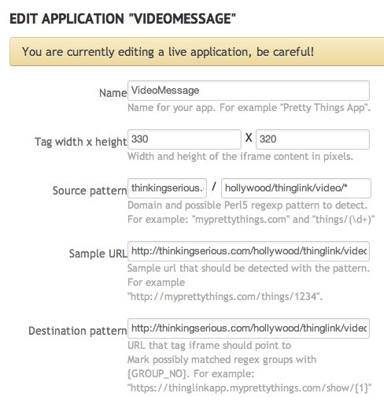

# Receive Video Messages from your Website with ThingLink and OpenTok

This hack was developed at [Hack Hollywood](http://hackhollywood.eventbrite.com), which was a two day hackathon. Unfortunately, I did not come to this particular idea until the second day with only 6 hours to go. So while this code is functional, it is definitely very rough, use at your own risk. That said, the code here should get you well on your way to either creating apps for the [thinglink](http://www.thinglink.com/developer/) platform or to learn how to create recorded video using [OpenTok](http://www.tokbox.com/opentok/api).

You can find a working demo [here](http://thinkingserious.com/hollywood). Note that any recoreded messages will be emailed to me, so please be nice :)

## Getting Started

To complete this tutorial you will need accounts at [thinklink](http://www.thinglink.com/developer/), [OpenTok](http://www.tokbox.com/opentok/api) and [SendGrid](http://sendgrid.com/pricing.html).

## Creating the thinglink App

After creating a new app from [this page](http://www.thinglink.com/developer/), here are the settings I used:

The code in the directory /hollywood is what I placed in the /hollywood/thinglink/video directory.

You will need to replace the text within double brackets in sendgrid_mailer.php 